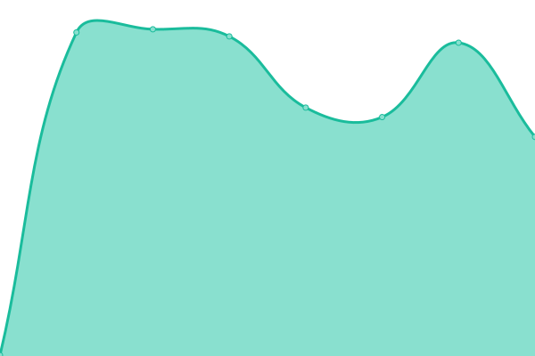
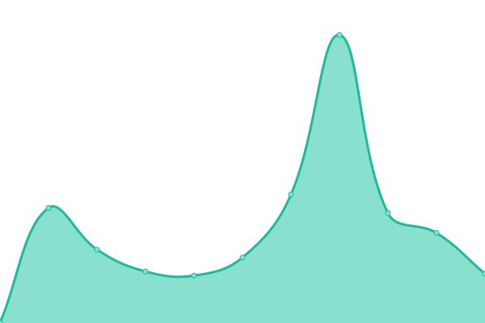
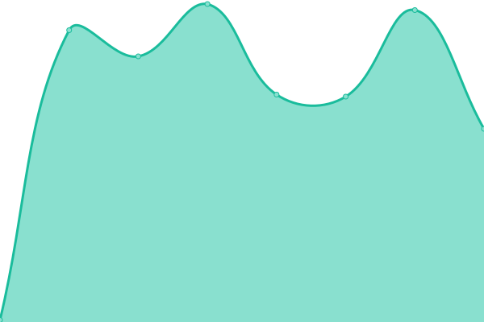
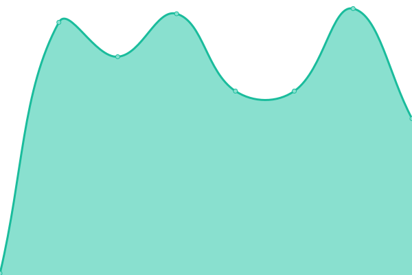
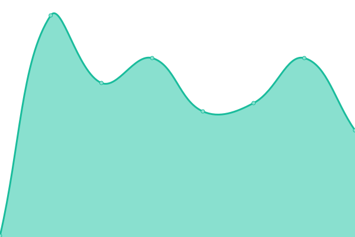

# [📈 Live Status](https://status.kmushicoin.co): <!--live status--> **🟧 Partial outage**

This repository contains the open-source uptime monitor and status page for [KmushiCoin](https://kmushicoin.co/), powered by [Upptime](https://github.com/upptime/upptime).

With [Upptime](https://upptime.js.org), you can get your own unlimited and free uptime monitor and status page, powered entirely by a GitHub repository. We use [Issues](https://github.com/kmushi-coin/status/issues) as incident reports, [Actions](https://github.com/kmushi-coin/status/actions) as uptime monitors, and [Pages](https://status.kmushicoin.co) for the status page.

<!--start: status pages-->
<!-- This summary is generated by Upptime (https://github.com/upptime/upptime) -->
<!-- Do not edit this manually, your changes will be overwritten -->
<!-- prettier-ignore -->
| URL | Status | History | Response Time | Uptime |
| --- | ------ | ------- | ------------- | ------ |
|  [Website - KmushiPay](https://kmushicoin.co/api/ping) | 🟩 Up | [website-kmushi-pay.yml](https://github.com/kmushi-coin/status/commits/HEAD/history/website-kmushi-pay.yml) | 

 426ms
     
 | 

<a href="https://status.kmushicoin.co/history/website-kmushi-pay">100.00%</a>
    

|  [API - SEND](https://new.kmushicoin.co/ping) | 🟥 Down | [api-send.yml](https://github.com/kmushi-coin/status/commits/HEAD/history/api-send.yml) | 

 2237ms
     
 | 

<a href="https://status.kmushicoin.co/history/api-send">99.53%</a>
    

|  [Explorer](https://explorer.kmushicoin.co/api/v2/block-index/0) | 🟩 Up | [explorer.yml](https://github.com/kmushi-coin/status/commits/HEAD/history/explorer.yml) | 

 292ms
     
 | 

<a href="https://status.kmushicoin.co/history/explorer">100.00%</a>
    

|  [VPS 3](ghos3.kmushicoin.co) | 🟩 Up | [vps-3.yml](https://github.com/kmushi-coin/status/commits/HEAD/history/vps-3.yml) | 

 102ms
     
 | 

<a href="https://status.kmushicoin.co/history/vps-3">100.00%</a>
    

|  [VPS 4](ghos4.kmushicoin.co) | 🟩 Up | [vps-4.yml](https://github.com/kmushi-coin/status/commits/HEAD/history/vps-4.yml) | 

 102ms
     
 | 

<a href="https://status.kmushicoin.co/history/vps-4">100.00%</a>
    

|  [VPS 5](ghos5.kmushicoin.co) | 🟩 Up | [vps-5.yml](https://github.com/kmushi-coin/status/commits/HEAD/history/vps-5.yml) | 

 102ms
     
 | 

<a href="https://status.kmushicoin.co/history/vps-5">100.00%</a>
    

|  [VPS 6](ghos6.kmushicoin.co) | 🟩 Up | [vps-6.yml](https://github.com/kmushi-coin/status/commits/HEAD/history/vps-6.yml) | 

 102ms
     
 | 

<a href="https://status.kmushicoin.co/history/vps-6">100.00%</a>
    

<!--end: status pages-->

[**Visit our status website →**](https://status.kmushicoin.co)

## 📄 License

- Powered by: [Upptime](https://github.com/upptime/upptime)
- Code: [MIT](./LICENSE) © [Anand Chowdhary](https://anandchowdhary.com), supported by [Pabio](https://pabio.com)
- Data in the `./history` directory: [Open Database License](https://opendatacommons.org/licenses/odbl/1-0/)
